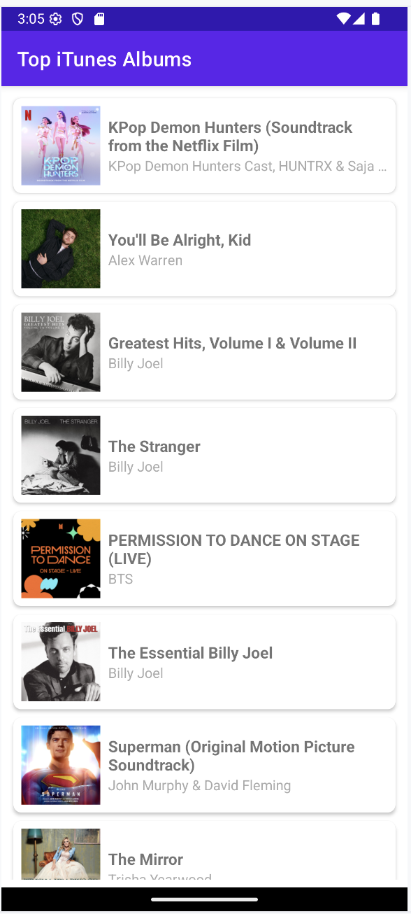
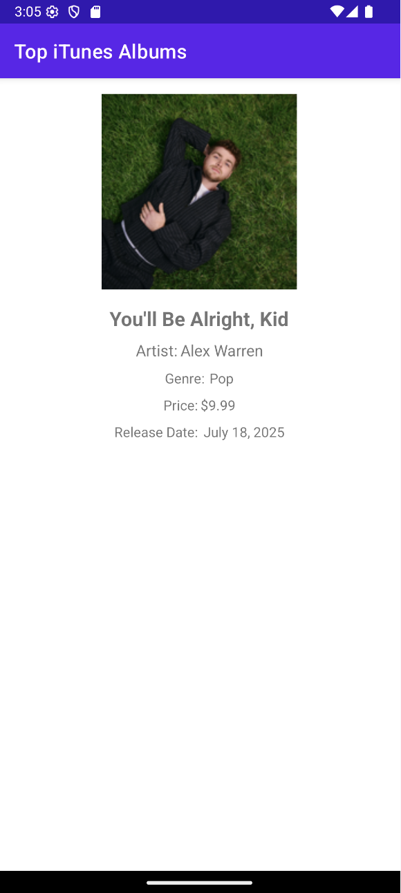

# 🎵 TopAlbumsApp

A modern Android app that displays the top 100 albums from the iTunes RSS feed. Built with MVVM, Retrofit, and LiveData.

---

## 🚀 Features

- Fetches top 100 albums from [iTunes RSS Feed](https://itunes.apple.com/us/rss/topalbums/limit=100/json)
- Displays album list with image, artist, genre, and release date
- Album details screen
- Error handling and loading indicators
- Unit tests for ViewModel
- MVVM architecture
- Dependency Injection (Hilt)
- Clean architecture principles

---

## 🖼️ Screenshots

| Album List | Album Details |
|------------|---------------|
|  |  |

---

## 🛠️ Tech Stack

- **Kotlin**
- **MVVM** architecture
- **Coroutines**
- **LiveData**
- **Retrofit2** for networking
- **Gson** for JSON parsing
- **Hilt** for DI
- **ViewBinding** or **DataBinding**
- **JUnit** for unit testing

---

## 🧪 Testing

- ViewModel unit tests: `AlbumListViewModelTest.kt`
- Mocked repository using `Mockito`

---

## 📦 Project Structure

Click to expand

com.example.topalbumsapp/ 
├── models/           # DTOs and domain models 
├── repositories/     # Repository + mapper 
├── services/         # Retrofit API 
├── network/          # Interceptors and network layer 
├── features/ 
├── ui/               # UI: Fragments, ViewModels, Adapters 
├── di/               # Dependency injection setup 
├── utils/            # Binding adapters, constants, helpers 
└── MainApplication.kt 

---

## 📲 Getting Started

### Prerequisites

- Android Studio Hedgehog or later
- Kotlin 1.9+
- Gradle 8+
- JDK 11

### Clone the repository

